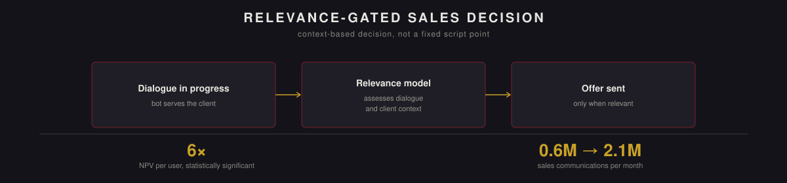

  

<a href="README.ru.md">Русская версия →</a>

# Context-Aware Sales Relevance Model for a Chatbot

> **Note on scope.** This describes methodology, decisions, and outcomes only; company name, exact revenue figures, internal system names, and implementation-level detail have been generalized or omitted. Figures below are given as relative changes (multiples, volumes) rather than absolute currency amounts.

Sales offers inside a chatbot used to be tied to fixed points in the script, regardless of what the conversation actually looked like at that moment. This project replaced that fixed-point logic with a model that decides, from the dialogue's actual context, whether an offer is appropriate right now — and made that decision the mechanism the channel now runs on entirely.

## At a glance

| | |
|---|---|
| **NPV per user (A/B, relevance model vs fixed points)** | grew 6× — statistically significant, no degradation on guardrail metrics |
| **Sales communications volume** | 0.6M → 2.1M dialogues per month |
| **Independent validation** | cross-checked against a dialogue-resolution model built by another team, not trained on these criteria |
| **Status** | live on 100% of bot traffic; the same logic is now being extended to operators, and used to find further automation opportunities |

## The problem

Two channels can make a sale: the bot, or a human operator. The bot is scalable, cheap, and fully controllable — but before this project it could only sell at fixed points in a script, with zero awareness of dialogue context. That meant it could offer a product to someone whose problem wasn't solved, or who was actively frustrated. Worse, the sales points themselves were a moving target, and maintaining sales logic on top of a constantly shifting foundation doesn't scale. Operators, by contrast, understand context naturally but are expensive, inconsistent without shared rules, and cover only a small share of total volume.

The question: how do you combine the bot's scalability with a human's contextual judgment?

## Defining "relevant"

Before training anything, the team needed to agree on what counts as a relevant sale. Several measurable criteria assessing the dialogue's actual context were defined by the author and aligned with the quality team, which then became both the labeling instructions and the model's target.

The key design insight: **context decides, not topic.** The same topic can be relevant in one dialogue and not in another, depending on how that specific conversation unfolded — which is exactly why a static, topic-based rule can't do this job, and a model reading dialogue state can.

## Production pipeline

The author designed the end-to-end pipeline for scoring, evaluating relevance, and sending offers; ML and backend engineering implemented it to that specification. The mechanism is now shared across every offer on the channel, replacing what used to be separate, offer-specific logic.

## How the model is built

- **Gold-standard dataset.** Built jointly with the quality team, through several rounds of instruction refinement, before any modeling decisions were made — model quality can't exceed the quality of what it's trained to match.
- **The precision–recall trade-off as a business decision, not a technical one.** There's a curve trading off recall on non-sales against recall on sales, and where you sit on it isn't a modeling question — it's a judgment about which error costs more. A missed sale is recoverable at the next contact; an inappropriate one costs client trust, and on some topics that cost doesn't come back. So recall on non-sales was fixed as a hard constraint, and recall on sales was maximized inside it.
- **What the model actually looks at.** Dialogue and client state, not a static classification — which is exactly why it doesn't break when the underlying script or categorization changes under it.
- **Training data.** The model was trained on real bot and operator conversions — filtered to exclude fraud-risk cases and keep only clearly successful outcomes with valid reasoning for non-sales — with the target and acceptance metrics defined by the author and the test designed by the author. **Model training itself was carried out by an ML engineer against this specification** — worth stating plainly, since it's a natural division of labor, not a gap.

## Results and honest post-analysis

The A/B test ran fixed-point sales against the relevance model over three weeks with roughly a million and a half users per group. NPV per user grew 6×, statistically significant, while both guardrail metrics (CSAT and cost per user) stayed flat.

A metric turning green isn't proof the decision logic is actually right, so a full post-analysis followed:

- **Two waves of expert relabeling** confirmed client experience didn't degrade — negativity after an offer stayed at the same level, and objections in the test group were, if anything, lower than in control.
- **Comparing against the previous fixed sales points**, the model preserved most of the earlier coverage, and most of what it declined to sell on was explained by unresolved problems — reading those dialogues by hand confirmed the verdicts were correct.
- **The strongest check**: dialogues were run through an independently built dialogue-resolution model — developed by a different team, not trained on these relevance criteria at all. By that external, unbiased standard, the relevance model still came out ahead of the mechanics it replaced. A meaningful share of dialogues where a sale happened would have been flagged as unresolved by that outside model — a useful, humbling number that fed directly into the next iteration rather than getting buried.

A few concrete changes came out of the post-analysis: a hard stop-list for certain higher-risk conversation categories regardless of model verdict (the cost of this was calculated in advance and found negligible against the benefit), removal of previously mis-attributed organic conversions the client had actually initiated themselves, and a dedicated track for procedural objection handling, since most objections turned out to be repetitive and didn't need an expensive model in the loop.

Conversion into a completed sale improved significantly as the model matured, cost per user dropped, and CSAT held steady throughout.

## What's next

Building this pipeline made it straightforward to extend the same relevance logic to operator-facing dialogues, which currently have no shared rules for when a sale is appropriate — that work is in active development. The same approach is now also being used more broadly to systematically identify further points in the sales flow where automation can be extended.

## Tech stack

Python · LLM-based classification · A/B testing methodology · production ML/backend integration (implemented by ML engineering to this specification)

---

Individually initiated and led project, from problem framing through production rollout. Model training was performed by an ML engineer against the author's specification. Described here for portfolio purposes with company-identifying details, implementation specifics, and absolute figures generalized or omitted.
